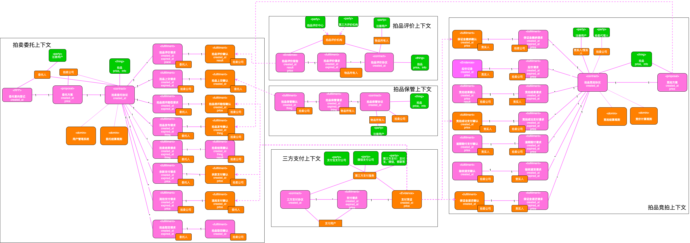
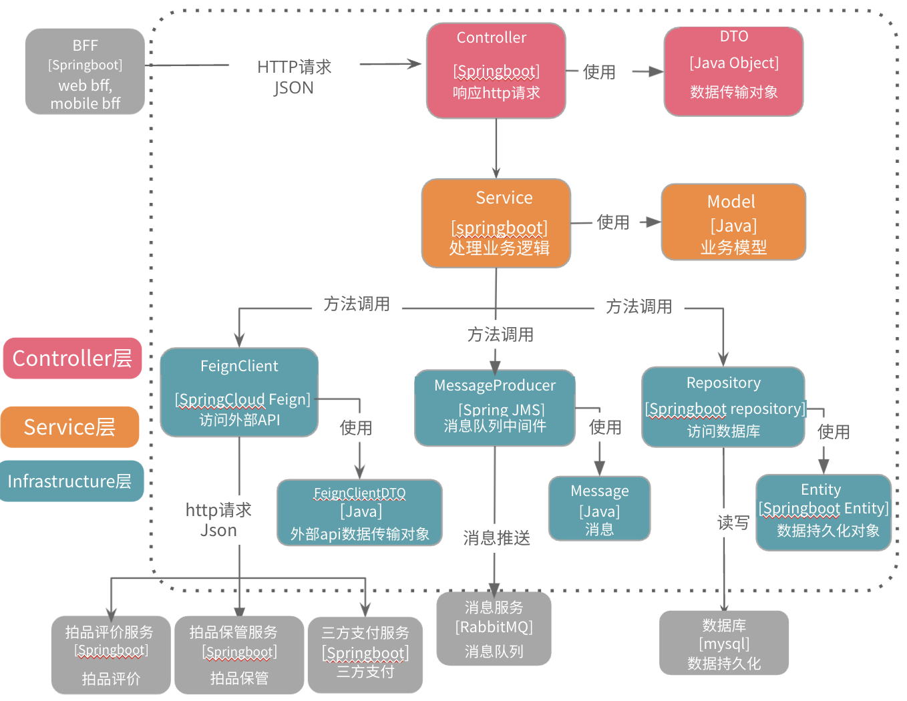

# 拍卖委托服务

## 业务介绍

承接拍卖委托。支持意向登记，委托方案出示，拍品评价，拍品上交、发布，拍卖结果查看，余款支付，流拍费用支付，拍品取回等功能

## 架构设计

- 【Controller 层】： 定义接口的URI，处理request，调用service实现功能，实现DTO和model的转化
- 【Service 层】：负责核心业务逻辑的实现。依赖infrastucture层与外部系统集成。负责model与infrastruture层数据转换
- 【Infrastructure层】：与外部系统进行集成，使用多种数据格式与外部系统打交道
    - FeignClient：与外部系统进行集成，负责调用外部API获取数据
    - MessageProducer： 消息队列中间件，负责发布消息到消息队列
    - Repository：数据库读写操作

